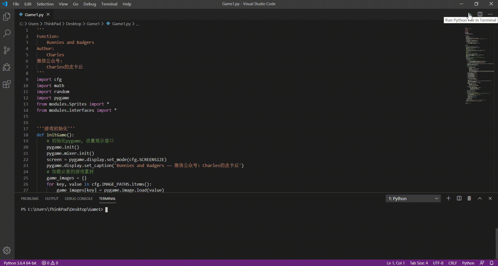

# Introduction
https://mp.weixin.qq.com/s/_-AChGldQzdwXN-ljcCMFQ

# Environment
```
OS: Windows10
Python: Python3.5+(have installed necessary dependencies)
```

# Usage
```
Step1:
pip install -r requirements.txt
Step2:
run "python Game1.py"
```

# Reference
https://www.raywenderlich.com/24252/beginning-game-programming-for-teens-with-python

# Game Display
