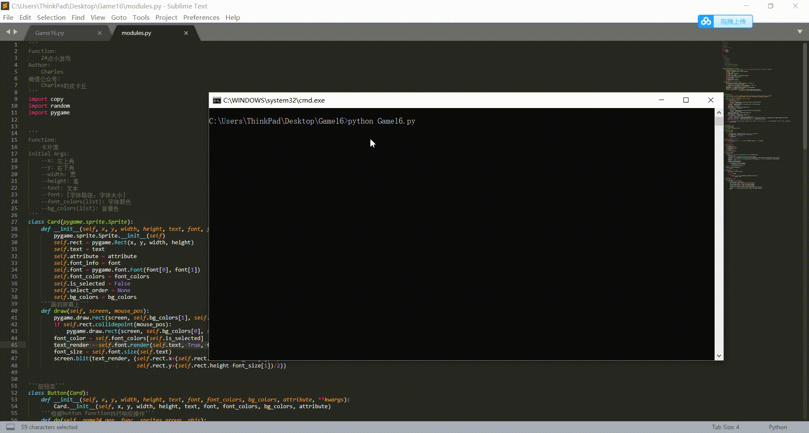

# Introduction
https://mp.weixin.qq.com/s/raronw7X0WlntI48nUOvoQ

# Environment(Tested)
- Windows10
- Python3.5+(have installed necessary dependencies)

# Usage
- pip install -r requirements.txt
- python Game16.py

# Packages
- os
- sys
- copy
- random
- pygame
- fractions

# Game Display
